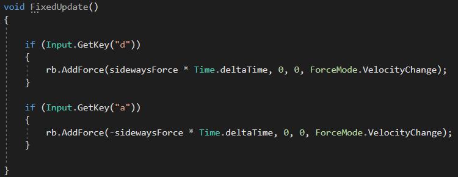
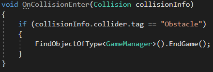
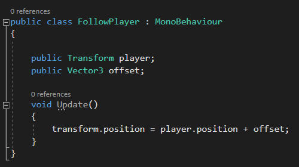

# Sluyd

Uniy öğrenmek için yaptığım ve bitirdiğim ilk oyun. Oyunu yaparken öğrendiklerimden önemli gördüklerimi hem tekrar etmek
hem paylaşmak hem de ileride dönüp bakabilmek için buraya belgeleyeceğim.

1-*Yukarıda gördüğünüz gibi oyunun fizik motorunu etkileyen işlemler yapacaksak bunları FixedUpdate'in içinde yapmalıyız*

2-*FixedUpdate ve Update metotları oyunun her karesinde çalışırlar yani eğer sizin bilgisayarınız oyunu 60 fps'de çalıştırıyorsa* *bu metot saniyede 60 kere ya da 120 fps'de çalıştırıyorsa 120 kere çalışır. Yukarıdaki resimde gördüğümüz gibi sabit bir güç*
*uygulandığında, bilgisayarın çalıştırma gücüne göre nesnenin hızı değişecektir çünkü birisi saniyede 60 kere o gücü uygularken* *diğeri 120 kere uygulayacaktır. Bu durumu önlemek adına bu gücü Time.deltaTime ile çarparız.*

3-*Normal şartlarda gecikmeleri önlemek ve kontrollerin daha akıcı olması için Input'ların Update metodunda kontrol edilmesi* *gerekir yani yukarıda aslında yapmam gereken inputları Update içinde kontrol edip uyguladığım gücü FixedUpdate içinde yapmalıyım.*
*Ayrıca Unity kendi kontrol metotlarına sahip bunları kullanmak kullanıcıya çok daha iyi bir kontrol yeteneği sağlar.*

4-*ForceMode.VelocityChange, fizik motorunu kullanarak uyguladığımız gücün nesnenin kütlesini yok saymasını sağlar.*

1-*Burada nesne sürekli olarak Ground nesnesiyle temas halinde olduğu için kutularla çarptığını belirlemek için kutulara tag* *atayıp kontrolünü bu şekilde gerçekleştirdim*

2-*Oyunun çarpışmaları daha sık kontrol etmesi için RigidBody altında yer alan collision detection'ı continuous'a çektim ve* *proje ayarlarındaki zaman ayarlarında Fixed Timestep'i düşürdüm.*

