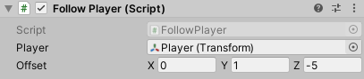
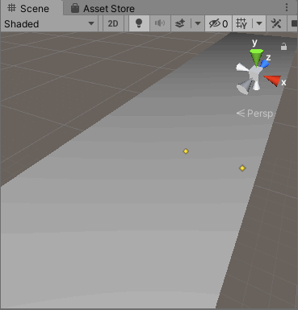
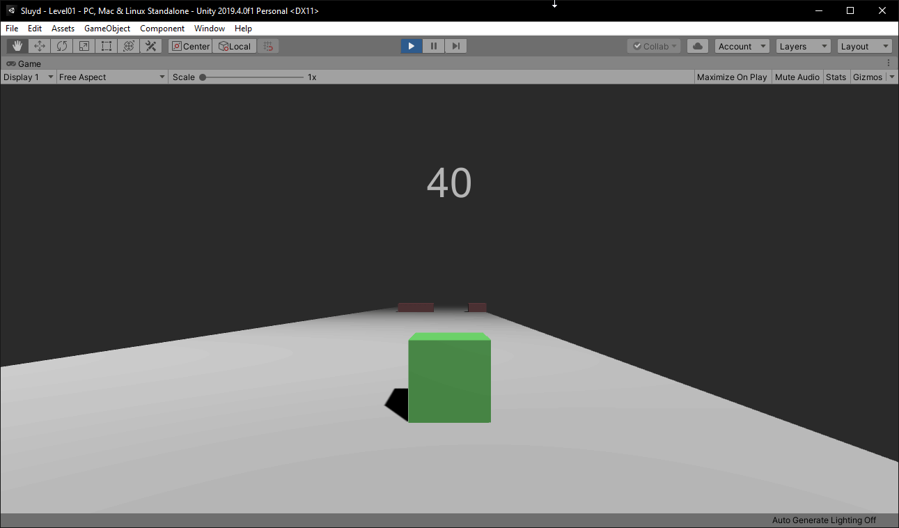
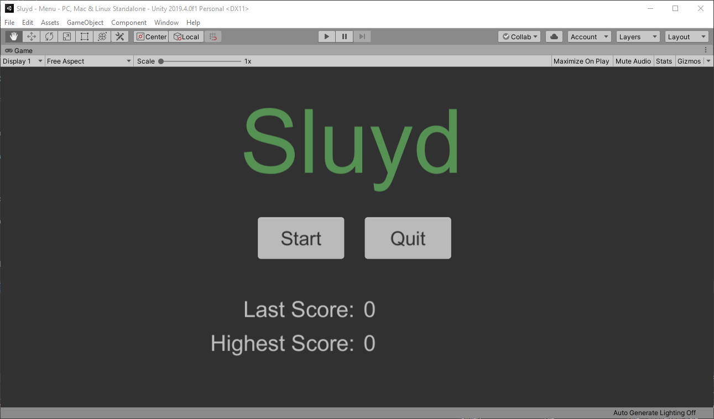

# Sluyd

Uniy öğrenmek için yaptığım ve bitirdiğim ilk oyun. Oyunu yaparken öğrendiklerimden önemli gördüklerimi hem tekrar etmek
hem paylaşmak hem de ileride dönüp bakabilmek için buraya belgeleyeceğim.

1-*Yukarıda gördüğünüz gibi oyunun fizik motorunu etkileyen işlemler yapacaksak bunları FixedUpdate'in içinde yapmalıyız*

2-*FixedUpdate ve Update metotları oyunun her karesinde çalışırlar yani eğer sizin bilgisayarınız oyunu 60 fps'de çalıştırıyorsa* *bu metot saniyede 60 kere ya da 120 fps'de çalıştırıyorsa 120 kere çalışır. Yukarıdaki resimde gördüğümüz gibi sabit bir güç*
*uygulandığında, bilgisayarın çalıştırma gücüne göre nesnenin hızı değişecektir çünkü birisi saniyede 60 kere o gücü uygularken* *diğeri 120 kere uygulayacaktır. Bu durumu önlemek adına bu gücü Time.deltaTime ile çarparız.*

3-*Normal şartlarda gecikmeleri önlemek ve kontrollerin daha akıcı olması için Input'ların Update metodunda kontrol edilmesi* *gerekir yani yukarıda aslında yapmam gereken inputları Update içinde kontrol edip uyguladığım gücü FixedUpdate içinde yapmalıyım.*
*Ayrıca Unity kendi kontrol metotlarına sahip bunları kullanmak kullanıcıya çok daha iyi bir kontrol yeteneği sağlar.*

4-*ForceMode.VelocityChange, fizik motorunu kullanarak uyguladığımız gücün nesnenin kütlesini yok saymasını sağlar.*

1-*Burada nesne sürekli olarak Ground nesnesiyle temas halinde olduğu için kutularla çarptığını belirlemek için kutulara tag* *atayıp kontrolünü bu şekilde gerçekleştirdim*

2-*Oyunun çarpışmaları daha sık kontrol etmesi için RigidBody altında yer alan collision detection'ı continuous'a çektim ve* *proje ayarlarındaki zaman ayarlarında Fixed Timestep'i düşürdüm.*

1-*Yukarıda kameranın oyuncuyu x,y,z kordinatlarında takip etmesi ama rotasyonunu takip etmemesini sağladım*

2-*Eğer yukarıdaki gibi public değişkenler belirlersek bunları aşağıdaki resimde olduğu gibi Unity'de inspector içinden değiştirebiliriz*

Buraya kadar olan bölümleri [Brackeys'in](https://www.youtube.com/watch?v=j48LtUkZRjU&list=PLPV2KyIb3jR5QFsefuO2RlAgWEz6EvVi6&index=1) eğitim videolarına bakarak yaptım fakat daha sonra kendim oyuna farklı mekanikler ekledim. Aşağıda onları açıklayacağım. Yaptığım değişikliklerin kodlarına proje içinden ulaşabilirsiniz, scriptlerin isimlerinin açıklayıcı olduğunu düşünüyorum.

1-*Oyunun seviyelerini tek tek yapmak yerine bir spawn sisteminin daha iyi olacağını düşündüm.Bu yüzden ilk yaptığım değişiklik*
*oyuncunun ilerlemesini durdurup, kutuların oyuncuya doğru gelmesini sağlamaktı. Böylece hem spawn kodlarını yazması kolaylaştı*
*hem de oyunun seviyesinin zemini bir hayli kısalmış oldu.*

2-*5 nokta belirledim ve bunlardan rastgele 2'sini her zaman boş olacak şekilde ayarladım.*

3-*Oluşan blokların memory'de yer kaplamaması ve birikmemesi için oyuncuyu geçtikten bir süre sonra silinmesini sağladım*

*-*Oyunun bittiğini kullanıcıya belirtmek için çarpışma anında oyunun yavaşlamasını sağladım*

Son olarak oyuna basit bir UI ve kullanıcıların başarılarını takip edebilmeleri için En yüksek skor kısmını ekledim.
(*Farklı scene'ler arasında değişkenleri aktarabilmek için Unity'nin [PlayerPrefs](https://docs.unity3d.com/ScriptReference/PlayerPrefs.html) modulünü kullandım*)
